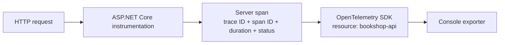

# Lab 2 — Automatic request tracing with OpenTelemetry

## Goal

Add OpenTelemetry tracing without changing the route handlers. Make several HTTP requests and inspect the automatically created server spans in the console.

## The idea

A trace is the end-to-end record of one unit of work. A span is one timed operation within that trace. In this lab, one HTTP request creates a server span. In Lab 7, the BookShop request will call Inventory and we will see a child dependency span connected to the same trace.

The ASP.NET Core instrumentation hooks into the framework's request pipeline. It observes route handling, status, and duration without us writing a span around every endpoint. OpenTelemetry's hosting integration manages the provider lifecycle, and the Console Exporter prints collected spans so we can learn locally. The console exporter is for debugging and learning; its output format is not standardized and it is not intended for production. [OpenTelemetry .NET exporters](https://opentelemetry.io/docs/languages/dotnet/exporters/) · [Console Exporter package](https://www.nuget.org/packages/OpenTelemetry.Exporter.Console)



## What changed

`OpenTelemetry.Extensions.Hosting` connects OpenTelemetry providers to the .NET host lifecycle. `OpenTelemetry.Instrumentation.AspNetCore` listens to inbound ASP.NET Core activity data. `OpenTelemetry.Exporter.Console` renders completed spans in the terminal. The resource names the emitting service as `bookshop-api`, so later, when other services are added, their telemetry can be distinguished.

These package versions are aligned with the current stable releases listed in NuGet: SDK/hosting/exporter `1.19.1`, ASP.NET Core instrumentation `1.19.0`. Pinning versions makes this lab reproducible; upgrades should be deliberate and revalidated.

## Run the experiment

Start the API:

```powershell
dotnet run --project src/BookShop.Api --urls http://localhost:5080
```

In another PowerShell window, send a few requests:

```powershell
Invoke-RestMethod http://localhost:5080/health
Invoke-RestMethod http://localhost:5080/books
Invoke-RestMethod http://localhost:5080/books/1
Invoke-RestMethod http://localhost:5080/books/999
```

Then create a server error and a slow request. The expected failure may print a PowerShell error; the API process should remain running:

```powershell
Invoke-RestMethod http://localhost:5080/lab/failure
Measure-Command { Invoke-RestMethod http://localhost:5080/lab/slow }
```

Look in the API terminal for exported `Activity.TraceId`, `Activity.SpanId`, `Activity.DisplayName`, start and end times, duration, and tags. A new request should have a new trace ID. The route's HTTP status is included on the span. The slow request should have a visibly longer duration than `/health`.

The exporter prints after a span ends. A request can also generate framework logs in the same terminal; distinguish those from the OpenTelemetry span block by its activity/trace identifiers and duration. This lab exports traces only. Metrics and OpenTelemetry logs are separate signals and will be added in Lab 4.

## Questions to answer

1. Which values identify the whole trace, and which identify this single server span?
2. Do successful, not-found, and failed requests all produce spans?
3. Does a trace ID survive across repeated, independent requests?
4. Why do we assign a stable service name in the resource instead of stamping it onto every span manually?
5. Why should console exporting be replaced with an appropriate collector or backend for deployed applications?

## Git checkpoint

After the experiment, commit the code and this guide:

```powershell
git add src/BookShop.Api docs/lab-2-local-tracing.md
git commit -m "feat: add local otel request tracing"
```

## Completion check

The app builds, each HTTP request produces an exported server span, and you can distinguish trace identity, span identity, service resource, status, and duration. No Azure resource is needed for this lab.
