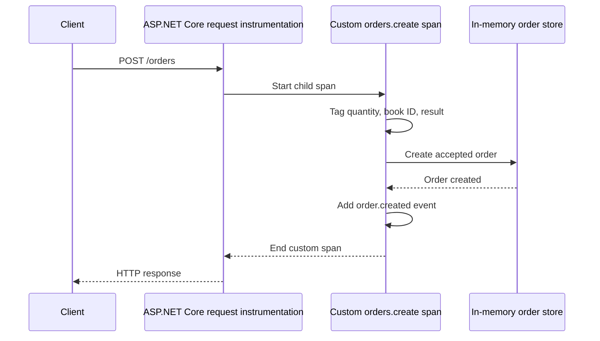

# Lab 3 — Add custom spans and events

## Goal

Instrument a business operation that automatic HTTP instrumentation cannot understand: creating a bookstore order. Compare the automatic server span with a custom `orders.create` span nested inside it.

## Why custom instrumentation?

Automatic instrumentation sees the HTTP request boundary. It cannot infer what “create an order” means, which branch of the business workflow ran, or when the order was accepted. A custom span marks that meaningful operation. Because it starts while ASP.NET Core's request activity is current, it becomes a child span in the same trace.

The span records bounded and useful context: quantity, book ID, and a small result category (`created`, `rejected_invalid_quantity`, or `rejected_book_not_found`). It emits an `order.created` event when the order is accepted. It deliberately does not record the book title or generated order ID: avoid sensitive or unnecessary values, and keep attributes stable enough to query.



## Understand the code

`BookShopTelemetry` owns a named `ActivitySource`. The tracing provider subscribes to that source with `.AddSource(BookShopTelemetry.SourceName)`. If the provider does not subscribe, `StartActivity` can return `null`; the null-conditional calls make the application behave normally when telemetry is absent.

`StartActivity("orders.create")` begins the custom span. Tags describe the operation and its outcome. `AddEvent` adds a timestamped point within the span, useful for a significant milestone that does not need its own duration. `using` ends the activity on every return path, including validation and not-found responses.

## Run the experiment

Stop the running API with **Ctrl+C**, then restart it so the new code is loaded:

```powershell
dotnet run --project src/BookShop.Api --urls http://localhost:5080
```

Send one successful order:

```powershell
Invoke-RestMethod -Method Post -Uri http://localhost:5080/orders `
  -ContentType 'application/json' -Body '{"bookId":1,"quantity":2}'
```

Then exercise both rejected outcomes:

```powershell
Invoke-RestMethod -Method Post -Uri http://localhost:5080/orders `
  -ContentType 'application/json' -Body '{"bookId":1,"quantity":0}'
Invoke-RestMethod -Method Post -Uri http://localhost:5080/orders `
  -ContentType 'application/json' -Body '{"bookId":999,"quantity":1}'
```

In the console, find the `orders.create` span inside each request trace. Compare the trace ID to the enclosing HTTP server span. Inspect the tags and event. The success span should include `bookshop.order.result = created` and the `order.created` event. Rejected operations should have their own result category and no `order.created` event.

## Key distinction: traces versus metrics

Span attributes can include useful per-operation context, including identifiers where appropriate and safe. Metric dimensions are aggregated and should stay low-cardinality. Do not turn order IDs or arbitrary user input into metric dimensions; Lab 4 will demonstrate this when we add a business counter and histogram.

## Questions to answer

1. What makes the custom span a child of the HTTP request span?
2. Which values describe the operation, and which value identifies an event within it?
3. Why is `bookshop.order.result` a small set of categories rather than the raw response or exception text?
4. Why is a generated order ID inappropriate as a metric dimension even when a span attribute may be useful for a carefully chosen correlation case?

## Git checkpoint

After observing all three outcomes, commit the implementation and guide:

```powershell
git add src/BookShop.Api/Program.cs docs/lab-3-custom-spans.md
git commit -m "feat: add custom order tracing"
```

## Completion check

Successful and rejected order attempts each have an `orders.create` span nested under the HTTP request span. You can explain its tags, event, and outcome, and the API behavior remains unchanged.
