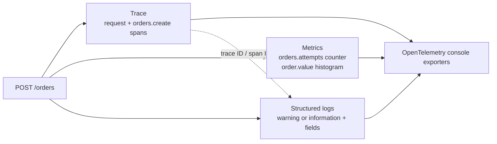

# Lab 4 — Business metrics and structured logs

## Goal

Add two signals that answer different questions from traces:

- **Metrics** aggregate measurements over time. They answer “how many orders were created?” and “what range of order values are we seeing?”
- **Logs** record individual events with named fields. They answer “what happened for this order attempt?”

The app already emits traces. This lab completes local collection of all three signals and shows how logs produced inside an HTTP request can carry the same trace and span IDs.



## Metrics: aggregation, not event records

`bookshop.orders.attempts` is a counter. It adds one for every order attempt and uses the `bookshop.order.result` attribute to distinguish three bounded outcomes: created, invalid quantity, and book not found. Future outcomes should be added as deliberate, bounded categories. `bookshop.order.value` is a histogram that records the total value of successful orders in the app's demo price units.

ASP.NET Core instrumentation also collects built-in HTTP server metrics, including request duration. The console metric reader exports every five seconds in this lab so you can see results quickly; a production pipeline normally uses a backend/collector and interval appropriate to its needs. [OpenTelemetry .NET ASP.NET Core metrics guide](https://opentelemetry.io/docs/languages/dotnet/metrics/getting-started-aspnetcore/)

Metric attributes must have bounded value sets. Here, the result attribute has a small number of intentional values. Do not use order IDs, arbitrary URLs, exception messages, or user-supplied values as metric attributes: each distinct combination creates another time series, increasing memory, cost, and query complexity.

## Logs: structured event details

The order route now uses `ILogger` with message templates and named placeholders. The OpenTelemetry logging provider exports those records, including the named values as structured attributes. It keeps the default .NET console provider as well, so you may see a regular console line and a verbose OpenTelemetry log record for the same event.

When a log is emitted during a request, OpenTelemetry .NET can automatically attach the active trace and span IDs. That lets an observability backend correlate a specific log with its request trace. Avoid logging secrets, payment data, or personal information. An order ID can be useful as a log field for a specific investigation, but it is not a metric label. [OpenTelemetry .NET log correlation](https://opentelemetry.io/docs/languages/dotnet/logs/correlation/) · [OpenTelemetry .NET ASP.NET Core logs guide](https://opentelemetry.io/docs/languages/dotnet/logs/getting-started-aspnetcore/)

## Run the experiment

Stop the current API with **Ctrl+C** and restart the instrumented app:

```powershell
dotnet run --project src/BookShop.Api --urls http://localhost:5080
```

Send several order attempts:

```powershell
Invoke-RestMethod -Method Post -Uri http://localhost:5080/orders `
  -ContentType 'application/json' -Body '{"bookId":1,"quantity":2}'
Invoke-RestMethod -Method Post -Uri http://localhost:5080/orders `
  -ContentType 'application/json' -Body '{"bookId":1,"quantity":3}'
Invoke-RestMethod -Method Post -Uri http://localhost:5080/orders `
  -ContentType 'application/json' -Body '{"bookId":1,"quantity":0}'
Invoke-RestMethod -Method Post -Uri http://localhost:5080/orders `
  -ContentType 'application/json' -Body '{"bookId":999,"quantity":1}'
```

Wait for the next five-second export and find `bookshop.orders.attempts`, `bookshop.order.value`, and HTTP server duration. Check the counter's created and rejected series and the histogram's count/sum/buckets. Compare those aggregates with the individual `orders.create` spans and logs. The two successful orders should produce two order-value measurements; rejected requests should not.

For a log record, compare its `TraceId` and `SpanId` with the IDs on the request or custom order span. The OTel log record should include structured fields such as `OrderId`, `BookId`, and `Quantity`; a regular console log may render the message as plain text.

## Questions to answer

1. Which signal gives you the individual order attempt, and which signal gives you the aggregate count?
2. What is the difference between a counter and a histogram in this app?
3. Why are these three intentional result values suitable for a metric attribute, but not an unbounded order ID?
4. Can you find an OTel log record with the same trace ID as its corresponding request span?
5. Why can a metric alert be more efficient than repeatedly searching all individual traces for a rising order rate?

## Git checkpoint

After you have observed all three signals, commit the app changes and guide:

```powershell
git add src/BookShop.Api/Program.cs docs/lab-4-metrics-and-logs.md
git commit -m "feat: add business metrics and structured logs"
```

## Completion check

You can see aggregate order attempts, order values, HTTP request duration, and structured logs. You can explain their different purposes, see log/trace correlation, and explain why metric attributes are bounded.
