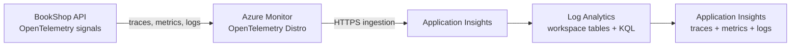

# Lab 5 — Send OpenTelemetry to Azure Monitor

## Goal

Send the traces, metrics, and logs from BookShop to Azure Monitor and inspect them in Application Insights. This lab uses the Azure Monitor OpenTelemetry Distro for ASP.NET Core, which bundles Azure Monitor export with commonly needed ASP.NET Core instrumentation. [Microsoft enablement guide](https://learn.microsoft.com/en-us/azure/azure-monitor/app/opentelemetry-enable?tabs=aspnetcore) · [Distro reference](https://learn.microsoft.com/en-us/dotnet/api/overview/azure/monitor.opentelemetry.aspnetcore-readme?view=azure-dotnet)



## Before creating Azure resources

The app only sends data when `APPLICATIONINSIGHTS_CONNECTION_STRING` is set. With the variable unset, it continues to use the local console exporters from Labs 2–4. The connection string is not committed to Git; it selects the destination resource and should still be handled as configuration.

Azure Monitor ingestion and Log Analytics retention can incur charges. Create only the lab resources, send a small number of requests, review the pricing/cost controls shown for your subscription, and delete the lab resource group when you no longer need it. A workspace-based Application Insights resource stores its data in a linked Log Analytics workspace. If you don't select an existing workspace, Azure can create one as part of resource creation. [Create a workspace-based Application Insights resource](https://learn.microsoft.com/en-us/azure/azure-monitor/app/create-workspace-resource?tabs=portal) · [Azure Monitor pricing](https://azure.microsoft.com/pricing/details/monitor/)

## Create the Azure resource

In the Azure portal:

1. Confirm the subscription shown in the portal is the one you intend to use.
2. Create a resource group named `rg-observability-labs` (or add a unique suffix if that name is taken) in a region convenient for you. Record the group and region in your private notes.
3. Create an **Application Insights** resource in that resource group. Use a short unique name such as `appi-bookshop-<suffix>`.
4. Ensure it is **workspace-based**. Select an existing Log Analytics workspace only if you deliberately want to share it; otherwise let the creation flow make a lab workspace.
5. After creation, open the Application Insights resource's **Overview** page and copy its **Connection String**. Do not put the actual value in a source file, `.env.example`, screenshot, or commit.

Keep this resource group for later Azure labs. The cleanup lab will remove it after we finish investigating telemetry and alerts.

## Connect the application

The app uses `Azure.Monitor.OpenTelemetry.AspNetCore` version `1.6.0` and detects the connection string from its environment. Microsoft recommends using the environment variable for deployment; this lab uses the same mechanism locally. The code keeps the custom `BookShop.Api` ActivitySource and `BookShop.Api` Meter registered with the Distro, so the `orders.create` spans and business metrics continue to be collected.

In PowerShell, use the same terminal window for setting the environment and running the app:

```powershell
$env:APPLICATIONINSIGHTS_CONNECTION_STRING = Read-Host "Paste the Application Insights connection string"
$env:OTEL_SERVICE_NAME = "bookshop-api"
dotnet run --project src/BookShop.Api --urls http://localhost:5080
```

The prompt keeps the value out of the command text saved in PowerShell history. The variable applies only to this PowerShell process and child processes; it is not written into the repository or persisted system-wide.

> If Windows blocks the app DLL before it starts, no telemetry can be sent. Resolve the local execution issue first; this Azure configuration does not change Windows application control behavior.

In a second window, generate a small amount of traffic:

```powershell
Invoke-RestMethod http://localhost:5080/health
Invoke-RestMethod http://localhost:5080/books
Invoke-RestMethod -Method Post -Uri http://localhost:5080/orders `
  -ContentType 'application/json' -Body '{"bookId":1,"quantity":2}'
Invoke-RestMethod -Method Post -Uri http://localhost:5080/orders `
  -ContentType 'application/json' -Body '{"bookId":1,"quantity":0}'
Invoke-RestMethod http://localhost:5080/lab/slow
```

Stop the app with **Ctrl+C** when you have enough telemetry. Remove the connection string from that PowerShell process:

```powershell
Remove-Item Env:APPLICATIONINSIGHTS_CONNECTION_STRING
Remove-Item Env:OTEL_SERVICE_NAME
```

## Explore Azure Monitor

Open the Application Insights resource and check:

1. **Live Metrics** while the app is running: look for incoming request activity.
2. **Transaction search** (or the current Application Insights transaction view): find `GET /health` and `POST /orders` requests, then inspect their traces and dependencies.
3. **Logs**: open the resource's Logs view and query recent telemetry. In the next lab, we will learn the table layout and write KQL investigations explicitly.
4. **Metrics**: look for request count/duration and the custom instruments if exposed in the metrics experience for the selected resource.

Ingestion can take several minutes to appear in stored views. Live Metrics is intended to provide a near-real-time view, while stored telemetry powers historical search and queries.

## What to notice

- A request trace includes the automatic HTTP server span and the custom `orders.create` span.
- Request success/failure and latency appear as individual trace records and as aggregates in metrics.
- Logs emitted inside a request carry trace context so they can be correlated with that request.
- Azure Monitor's Distro supplies Azure-specific export and common instrumentation; the application still creates its custom activities and measurements with OpenTelemetry APIs.

## Troubleshooting

- **No data**: verify the variable is present in the same PowerShell process that starts the app, check for a typo or accidental whitespace in the value, wait a few minutes, and confirm the resource and app are in the intended subscription/destination.
- **Only request traces appear**: exercise `POST /orders` to generate the custom span, business metric, and application log; confirm that the `BookShop.Api` ActivitySource and Meter names remain registered in `Program.cs`.
- **DLL blocked before startup**: the process must be allowed to run before export configuration matters. Azure cannot receive telemetry from an app Windows prevented from starting.
- **Connection string in Git**: remove it from the working tree and history before sharing the repository. Use the environment variable only.

## Git checkpoint

After you have connected the app and confirmed data reaches Application Insights, commit the code and guide:

```powershell
git add src/BookShop.Api/BookShop.Api.csproj src/BookShop.Api/Program.cs docs/lab-5-azure-monitor.md
git commit -m "feat: export telemetry to azure monitor"
```

## Completion check

The local app sends traces, metrics, and logs to the Application Insights resource; the connection string stays out of Git; and you can find requests and the order operation in Azure Monitor. Keep the resource group for Labs 6 and 9, then remove it during cleanup.
