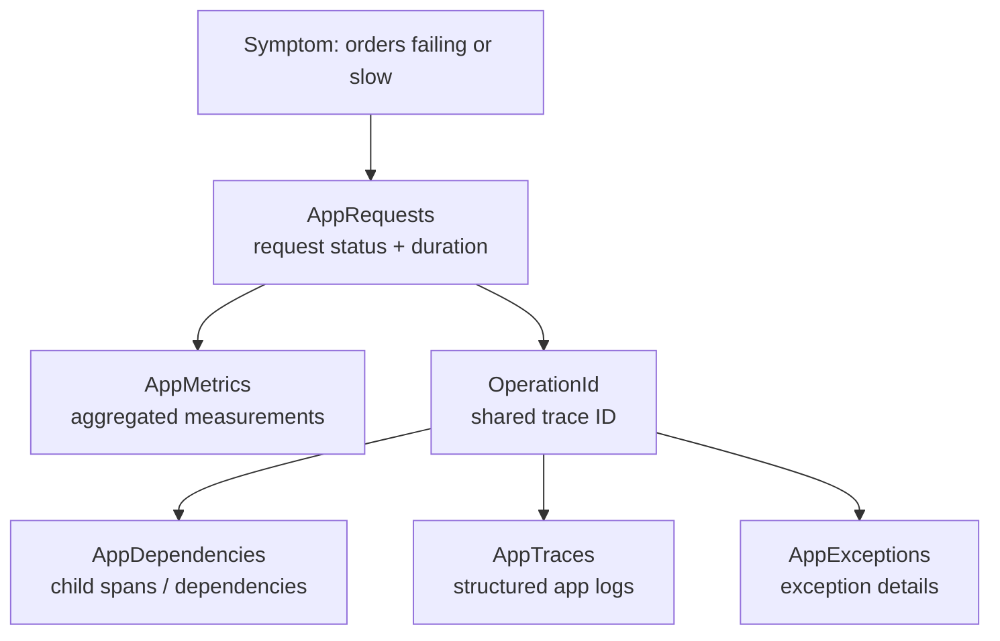

# Lab 6 — Investigate telemetry with KQL

## Goal

Use Kusto Query Language (KQL) in Application Insights / Log Analytics to answer operational questions with the telemetry BookShop sends. We will move from a symptom (failed or slow orders) to correlated evidence across requests, custom spans, logs, exceptions, and metrics.

In a workspace-based Application Insights resource, common OpenTelemetry signals are stored in tables such as `AppRequests`, `AppDependencies`, `AppTraces`, `AppExceptions`, and `AppMetrics`. The exact columns are visible in the Logs table schema and in Microsoft's table references. [OpenTelemetry table mapping](https://learn.microsoft.com/en-us/azure/azure-monitor/app/opentelemetry-filter) · [AppRequests schema](https://learn.microsoft.com/en-us/azure/azure-monitor/reference/tables/apprequests) · [AppDependencies schema](https://learn.microsoft.com/en-us/azure/azure-monitor/reference/tables/appdependencies) · [AppMetrics schema](https://learn.microsoft.com/en-us/azure/azure-monitor/reference/tables/appmetrics)

## Choose the Log Analytics workspace scope

Azure provides two KQL experiences for Application Insights data. The screenshot in the Lab 5 portal flow opens **Logs** on the Application Insights resource, which preserves the classic Application Insights table names: `requests`, `dependencies`, `traces`, `exceptions`, and `customMetrics`. The queries in this lab use the workspace table names: `AppRequests`, `AppDependencies`, `AppTraces`, `AppExceptions`, and `AppMetrics`.

To follow the lab queries, switch to the linked Log Analytics workspace:

1. Open the Application Insights resource and select **Overview**.
2. Find **Workspace** and select its blue linked workspace name. This opens the associated Log Analytics workspace.
3. In the workspace, select **Logs**. Confirm the query scope is the workspace (not the Application Insights resource), then expand **Log Management** in the Tables pane.
4. Look for `AppRequests`, `AppDependencies`, `AppTraces`, `AppExceptions`, and `AppMetrics`.

Microsoft documents that selecting the Application Insights app as the scope opens the backward-compatible classic query experience; selecting its linked workspace exposes the workspace-based schema. [Log query scope](https://learn.microsoft.com/en-us/azure/azure-monitor/logs/scope) · [Create workspace-based Application Insights resources](https://learn.microsoft.com/en-us/azure/azure-monitor/app/create-workspace-resource?tabs=portal)

If you want to stay in the Application Insights Logs screen shown in the screenshot, use its classic schema instead. For example, the Lab 6 request-discovery query becomes:

```kusto
requests
| where timestamp > ago(1h)
| project timestamp, name, url, success, resultCode, duration, operation_Id
| order by timestamp desc
```

The rest of this guide uses workspace table names and columns so the queries align with Log Analytics and the underlying workspace data.



## Open Logs and set a time range

1. Open the linked Log Analytics workspace using the steps above.
2. Select **Logs** and set the time range to include the traffic you generated in Lab 5 (for example, **Last 1 hour**).
3. Expand **Log Management** and inspect the schemas of `AppRequests`, `AppDependencies`, `AppTraces`, `AppExceptions`, and `AppMetrics`.
4. Run the queries below one at a time. The table schema and IntelliSense in the query editor are authoritative for the workspace you selected.

Logs can take several minutes to appear after ingestion. Start with a short time window while learning; narrower time filters make investigations faster and easier to reason about.

## Query 1 — Discover recent requests

```kusto
AppRequests
| where TimeGenerated > ago(1h)
| project TimeGenerated, Name, Url, Success, ResultCode, DurationMs, OperationId
| order by TimeGenerated desc
```

Find the `POST /orders` rows and note the `OperationId`. In Application Insights, this is the trace identifier used to correlate telemetry for the same operation. `Id` identifies a request span, while `OperationId` groups the end-to-end operation. [AppRequests table](https://learn.microsoft.com/en-us/azure/azure-monitor/reference/tables/apprequests)

If this query returns no data, verify the time range, resource scope, and that Lab 5 sent traffic successfully. Confirm `AppRequests` exists and contains new rows before moving on.

## Query 2 — Compare failure rate and latency by route

```kusto
AppRequests
| where TimeGenerated > ago(1h)
| summarize
    Requests = sum(ItemCount),
    Failures = sumif(ItemCount, Success == false),
    P50DurationMs = percentile(DurationMs, 50),
    P95DurationMs = percentile(DurationMs, 95)
    by bin(TimeGenerated, 5m), Name
| extend FailureRatePct = round(100.0 * Failures / Requests, 2)
| order by TimeGenerated asc
| render timechart
```

`ItemCount` matters when telemetry is sampled: one stored row can represent multiple items. The percentile query describes the observed distribution in the selected window; sampling can affect which request records are present. Compare routes and time buckets rather than interpreting a tiny lab sample as a stable production SLO.

Run `/lab/slow` several times, then rerun the query. Compare its duration distribution with `/health`. Call `/lab/failure` and compare the result code and failure rate.

## Query 3 — Find failed order requests and their exceptions

```kusto
AppRequests
| where TimeGenerated > ago(1h) and Success == false
| join kind=leftouter (
    AppExceptions
    | where TimeGenerated > ago(1h)
    | project OperationId, ExceptionType = OuterType, ExceptionMessage = OuterMessage
) on OperationId
| project TimeGenerated, Name, ResultCode, DurationMs, OperationId, ExceptionType, ExceptionMessage
| order by TimeGenerated desc
```

This join uses the shared operation ID to associate request records with exception records. An expected business rejection such as a 404 or validation response might not have an exception. The intentional `/lab/failure` route should create an exception record when exception telemetry is collected.

## Query 4 — Search structured application logs

```kusto
AppTraces
| where TimeGenerated > ago(1h)
| where Message has "Order"
| project TimeGenerated, SeverityLevel, Message, OperationId, ParentId, Properties
| order by TimeGenerated desc
```

Inspect `Properties` for the named log fields such as `OrderId`, `BookId`, and `Quantity`. Pick an `OperationId` from a matching log and find the same value in `AppRequests`. This is the log-to-trace correlation learned in Lab 4. [AppTraces schema](https://learn.microsoft.com/en-us/azure/azure-monitor/reference/tables/apptraces)

## Query 5 — Inspect custom order metrics

First see what metric names and dimensions arrived:

```kusto
AppMetrics
| where TimeGenerated > ago(1h)
| where Name startswith "bookshop."
| project TimeGenerated, Name, Sum, ItemCount, Min, Max, Properties
| order by TimeGenerated desc
```

Then summarize the custom order measurements:

```kusto
AppMetrics
| where TimeGenerated > ago(1h)
| where Name in ("bookshop.orders.attempts", "bookshop.order.value")
| summarize
    MeasurementCount = sum(ItemCount),
    MeasurementSum = sum(Sum),
    Minimum = min(Min),
    Maximum = max(Max)
    by bin(TimeGenerated, 5m), Name
| order by TimeGenerated asc
```

For counters, `Sum` represents the accumulated count. For histograms, `Sum` is the sum of recorded values and `ItemCount` is the number of measurements represented. Inspect the raw `Properties` before grouping by a custom dimension; metric rows are aggregated, not individual order events. The `AppMetrics` reference documents `Sum`, `ItemCount`, `Min`, and `Max`. [AppMetrics schema](https://learn.microsoft.com/en-us/azure/azure-monitor/reference/tables/appmetrics)

## Query 6 — Reconstruct one order trace across tables

Copy an `OperationId` from a recent `POST /orders` row in Query 1, then replace the placeholder below:

```kusto
let operationId = "replace-with-operation-id";
union kind=outer
    (AppRequests
        | project TimeGenerated, OperationId, ItemKind = "request", Name,
                  Details = strcat("status=", ResultCode, "; success=", Success,
                                   "; durationMs=", DurationMs)),
    (AppDependencies
        | project TimeGenerated, OperationId, ItemKind = "dependency", Name,
                  Details = strcat("target=", Target, "; success=", Success,
                                   "; durationMs=", DurationMs)),
    (AppTraces
        | project TimeGenerated, OperationId, ItemKind = "log", Name = Message,
                  Details = strcat("severity=", SeverityLevel)),
    (AppExceptions
        | project TimeGenerated, OperationId, ItemKind = "exception", Name = OuterType,
                  Details = OuterMessage)
| where OperationId == operationId
| project TimeGenerated, ItemKind, Name, Details, OperationId
| order by TimeGenerated asc
```

This creates a shared result shape from four different tables, then filters it to one operation. Expect the request and logs from the selected operation; dependencies or exceptions appear only when they were emitted for that request. Open the same request in the Application Insights transaction details view to compare the visual trace with the KQL result.

## Investigation exercise — slow or failing order?

Answer this scenario using the queries rather than guessing:

1. Use Query 2 to identify whether `/orders` failures, `/lab/failure`, or slow requests are driving the failure/latency pattern.
2. Use Query 1 to select one representative `POST /orders` operation and copy its `OperationId`.
3. Use Query 6 to find all related records for that operation.
4. Use Query 4 to inspect the structured log fields and Query 3 if an exception is present.
5. Write a short incident note: **symptom**, **evidence**, **likely cause**, and **next diagnostic step**.

## Common KQL errors and fixes

- **`Failed to resolve table`**: check whether the query scope is the Application Insights resource or its linked workspace, and inspect the available table names. Workspace-based resources use `AppRequests` and related tables; legacy Application Insights query experiences may show different names.
- **No rows**: widen the time range, confirm Lab 5 traffic was sent, and wait for ingestion.
- **`summarize` looks different from raw row count**: account for `ItemCount`, which represents sampled or aggregated items.
- **A column name fails**: inspect the table schema and adapt the query. Application Insights schema evolves; table references are current as of this lab's preparation.
- **Join multiplies results**: one operation can contain multiple exception/log records. Inspect the matching rows before summarizing, and decide whether the desired unit is request, exception, or log record.

## Git checkpoint

After running the queries and writing your incident note, commit this lab:

```powershell
git add docs/lab-6-kql-investigations.md
git commit -m "docs: add azure monitor investigation queries"
git push
```

The repository workflow asks Codex to push after each commit; the explicit `git push` is included here so the checkpoint is also clear when you follow the lab yourself.

## Completion check

You can summarize requests and latency, find failures and exceptions, query structured logs and metrics, and correlate records by `OperationId`. You can explain why a KQL summary may not equal the raw row count and have saved one short incident note.
