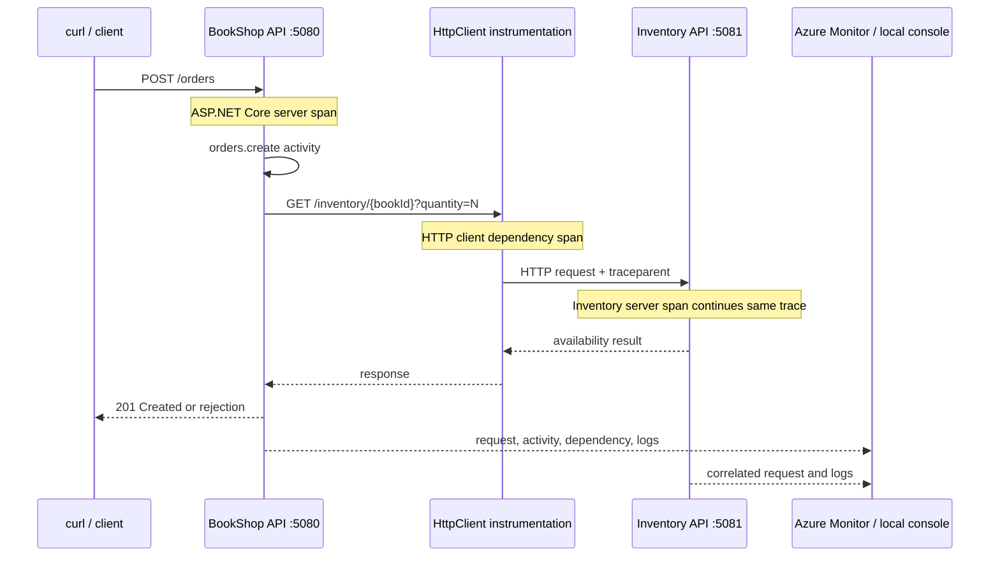

# Lab 7: Distributed tracing across two .NET services

## Goal

Follow one order request as it moves from BookShop API to a separate Inventory API. A distributed trace joins spans from both processes so you can locate latency or errors across a service boundary.

## Architecture



The W3C `traceparent` header carries a trace ID and the caller's span ID. The inventory request therefore keeps the original trace ID and becomes a child operation even though it runs in another process. The HTTP instrumentation creates the outgoing dependency span; ASP.NET Core instrumentation creates the receiving request span. `orders.create` is our business activity between them.

## 1. Run both services locally

Open two PowerShell terminals at the repository root. For local console output, make sure neither terminal has an Application Insights connection string set:

```powershell
Remove-Item Env:APPLICATIONINSIGHTS_CONNECTION_STRING -ErrorAction SilentlyContinue
```

Terminal 1, Inventory API:

```powershell
$env:OTEL_SERVICE_NAME = "inventory-api"
dotnet run --project src/Inventory.Api --urls http://localhost:5081
```

Terminal 2, BookShop API:

```powershell
$env:OTEL_SERVICE_NAME = "bookshop-api"
$env:INVENTORY_BASE_URL = "http://localhost:5081"
dotnet run --project src/BookShop.Api --urls http://localhost:5080
```

The service name is resource metadata that labels telemetry from each process. A distinct service name makes the two roles easy to distinguish in Azure. `INVENTORY_BASE_URL` keeps the local dependency address configurable.

## 2. Generate a successful trace

In a third terminal:

```powershell
curl.exe -i -X POST http://localhost:5080/orders `
  -H "Content-Type: application/json" `
  -d '{"bookId":1,"quantity":2}'
```

Expect `201 Created`. Look at both service terminals. In BookShop, find the incoming `/orders` request, the `orders.create` activity, and an HTTP client span to port 5081. In Inventory, find the incoming `/inventory/1` request. Their trace IDs should match; the parent span ID of the inventory request should correspond to the outgoing client operation. Console output formats vary by exporter version, so compare IDs and operation names rather than relying on exact formatting.

Try an insufficient quantity:

```powershell
curl.exe -i -X POST http://localhost:5080/orders `
  -H "Content-Type: application/json" `
  -d '{"bookId":2,"quantity":5}'
```

Inventory has four units of book 2, so the order should be rejected with `409 Conflict`. This is a successful service interaction that returns a business rejection. Compare it with an unknown book (`bookId` 99), which BookShop rejects before making a dependency call.

## 3. Observe a dependency failure

Stop Inventory with Ctrl+C, then submit the successful request again. BookShop should return `503 Service Unavailable`; the trace should show a failed outgoing dependency. Restart Inventory and retry. This illustrates why the whole trace matters: the API request is where the user sees the failure, while the dependency span identifies which downstream call failed.

## 4. Send both services to Application Insights (optional)

Set the same Application Insights connection string in each terminal, but keep distinct service names. Do not commit the connection string.

```powershell
$env:APPLICATIONINSIGHTS_CONNECTION_STRING = "InstrumentationKey=...;IngestionEndpoint=..."
```

Restart each app with its own `OTEL_SERVICE_NAME`. Azure Monitor's .NET distro bundles ASP.NET Core and `HttpClient` instrumentation. In the workspace connected to your Application Insights resource, run:

```kusto
AppRequests
| where TimeGenerated > ago(30m)
| where Name has "orders" or Name has "inventory"
| project TimeGenerated, AppRoleName, Name, Success, ResultCode, OperationId, ParentId, Id
| order by TimeGenerated desc
```

Then inspect dependencies:

```kusto
AppDependencies
| where TimeGenerated > ago(30m)
| where Target has "localhost:5081" or Name has "inventory"
| project TimeGenerated, AppRoleName, Name, Target, Success, ResultCode, OperationId, Id, ParentId
| order by TimeGenerated desc
```

Copy an `OperationId` from a request and filter both tables by that value to see the request and dependency within one trace. In the Application Insights resource's Logs experience, the classic table names may instead be `requests` and `dependencies`; use the corresponding queries from Lab 6 if your workspace schema is classic.

## What to notice

- One trace can contain spans emitted by multiple services and processes.
- Automatic instrumentation records framework and network boundaries; a custom activity records business work.
- Trace context propagation is what connects spans across HTTP. Without it, each service would have unrelated trace IDs.
- A dependency's failure, the API's response, and the business outcome answer different questions; correlated telemetry lets you move between them.
- In-memory stock is only a teaching stub. It is not shared persistence and it resets when Inventory restarts.

## References

- [OpenTelemetry .NET HTTP instrumentation](https://www.nuget.org/packages/OpenTelemetry.Instrumentation.Http/1.19.0)
- [Azure Monitor OpenTelemetry data collection](https://learn.microsoft.com/azure/azure-monitor/app/opentelemetry-collect-detect)
