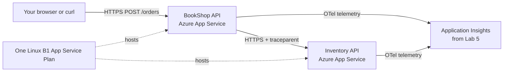

# Lab 8: Deploy both APIs to Azure App Service

## Goal

Deploy BookShop and Inventory as two .NET 10 web apps. Follow an order trace across the public HTTP boundary and verify that both services send telemetry to the Application Insights resource from Lab 5.

This lab creates Azure compute resources. An App Service Plan continues to incur charges while it exists, even when there is little or no traffic. Review the estimate for your selected subscription and region before creating it. The example below uses one Linux **Basic B1** plan shared by two web apps, so you pay for one plan rather than two. Actual charges vary by region, currency, agreement, and time. See [App Service pricing](https://azure.microsoft.com/pricing/details/app-service/) and the [Azure pricing calculator](https://azure.microsoft.com/pricing/calculator/).

These demo APIs have no authentication and will be publicly reachable. Use only synthetic data, do not add secrets or real customer information, and delete the apps after the lab. If you want to keep them online, add an access restriction or authentication before sharing the URL.

## Architecture



## 1. Confirm the Azure target and cost

Use the Azure portal or CLI to confirm the subscription you intend to use. Identify the resource group containing the Application Insights resource from Lab 5, and note the resource's connection string without putting it in a source file or Git.

Choose:

- **Resource group:** reuse the Lab 5 group so App Service and Application Insights are easy to clean up together. Do not delete that entire group at the end because it also contains monitoring resources used in Lab 9.
- **Region:** use a region supported by your subscription and near your users. App Service Plan and Application Insights may be in different regions, but colocating them reduces cross-region traffic.
- **Plan:** Linux Basic B1 for this lab, unless your subscription's current price/quotas lead you to choose another tier. Two apps can share this plan. Review the displayed recurring estimate before creation.
- **App names:** choose two globally unique names, for example `bookshop-<unique-suffix>` and `inventory-<unique-suffix>`. Azure assigns each a public `azurewebsites.net` hostname.

Check [current App Service pricing](https://azure.microsoft.com/pricing/details/app-service/) for your region and currency. The plan is the main recurring compute cost. Application Insights ingestion/retention may add a separate charge based on your existing resource's configuration and telemetry volume.

## 2. Create the plan and two web apps

In PowerShell, set these values to the names and region you selected. Replace every placeholder before running the commands. Do not paste a subscription ID or connection string into this tracked document.

```powershell
$resourceGroup = "<existing-lab-resource-group>"
$location = "<azure-region>"
$planName = "plan-observability-labs"
$bookShopApp = "<globally-unique-bookshop-name>"
$inventoryApp = "<globally-unique-inventory-name>"
```

Confirm the active subscription and resource group before the first create command:

```powershell
az account show --output table
az group show --name $resourceGroup --output table
```

Create one Linux plan, then two .NET 10 Linux apps on that plan:

```powershell
az appservice plan create `
  --name $planName `
  --resource-group $resourceGroup `
  --location $location `
  --sku B1 `
  --is-linux

az webapp create `
  --name $bookShopApp `
  --resource-group $resourceGroup `
  --plan $planName `
  --runtime "DOTNETCORE:10.0"

az webapp create `
  --name $inventoryApp `
  --resource-group $resourceGroup `
  --plan $planName `
  --runtime "DOTNETCORE:10.0"
```

Microsoft's current App Service CLI examples use the `DOTNETCORE:10.0` runtime identifier and `az webapp deploy` for ZIP artifacts. If the portal or CLI reports that this runtime is unavailable in your region, stop and check the runtime stacks currently offered for that region before creating a substitute. [App Service .NET quickstart](https://learn.microsoft.com/en-us/azure/app-service/quickstart-dotnetcore) · [Azure CLI `az webapp`](https://learn.microsoft.com/en-us/cli/azure/webapp?view=azure-cli-latest)

## 3. Configure service names, dependency address, and telemetry

Use the App Service portal for each app: **Settings > Environment variables** (older portal wording may say **Configuration > Application settings**). Add these settings, then save and allow the apps to restart:

| App | Setting | Value |
| --- | --- | --- |
| BookShop | `OTEL_SERVICE_NAME` | `bookshop-api` |
| BookShop | `INVENTORY_BASE_URL` | `https://<inventory-app-name>.azurewebsites.net` |
| BookShop | `APPLICATIONINSIGHTS_CONNECTION_STRING` | Connection string from the Lab 5 Application Insights resource |
| Inventory | `OTEL_SERVICE_NAME` | `inventory-api` |
| Inventory | `APPLICATIONINSIGHTS_CONNECTION_STRING` | The same Lab 5 Application Insights connection string |

The connection string is an app setting (environment variable) read by the Azure Monitor OpenTelemetry Distro. Add it only in the Azure portal or through a secure secret workflow. Do not commit it, add it to `appsettings.json`, or put its literal value in shell history. App Service settings are encrypted at rest by the platform, but users with sufficient app configuration permissions can read them; restrict those permissions appropriately. [Configure App Service settings](https://learn.microsoft.com/en-us/azure/app-service/configure-common)

The different service names distinguish telemetry roles in Application Insights. The Inventory URL must be HTTPS so the public API-to-API call is encrypted. App Service supplies the server URL/port and HTTPS endpoint; the application code does not need hard-coded deployment ports.

## 4. Publish and deploy the applications

From the repository root, publish each API in Release mode. The output paths below are ignored build artifacts and should not be committed.

```powershell
dotnet publish src/Inventory.Api/Inventory.Api.csproj -c Release -o artifacts/publish/inventory
dotnet publish src/BookShop.Api/BookShop.Api.csproj -c Release -o artifacts/publish/bookshop

Compress-Archive -Path artifacts/publish/inventory/* -DestinationPath artifacts/inventory.zip -Force
Compress-Archive -Path artifacts/publish/bookshop/* -DestinationPath artifacts/bookshop.zip -Force
```

The ZIP must contain the published files at its root, including the app's `.dll` and `.deps.json`; do not zip the parent folder itself. Deploy each ZIP to its already-created web app:

```powershell
az webapp deploy --resource-group $resourceGroup --name $inventoryApp --src-path artifacts/inventory.zip --type zip
az webapp deploy --resource-group $resourceGroup --name $bookShopApp --src-path artifacts/bookshop.zip --type zip
```

ZIP deployment does not build source code in Azure. These commands deploy the prebuilt Release output. [Deploy files to App Service](https://learn.microsoft.com/en-us/azure/app-service/deploy-zip?tabs=cli)

## 5. Generate and inspect a distributed trace

Check both health endpoints:

```powershell
Invoke-RestMethod "https://$bookShopApp.azurewebsites.net/health"
Invoke-RestMethod "https://$inventoryApp.azurewebsites.net/health"
```

Submit an order:

```powershell
Invoke-RestMethod -Method Post `
  -Uri "https://$bookShopApp.azurewebsites.net/orders" `
  -ContentType "application/json" `
  -Body '{"bookId":1,"quantity":2}'
```

Expect an order response. Then try the out-of-stock path (`bookId: 2`, `quantity: 5`) and the invalid-book path (`bookId: 99`). Allow a few minutes for stored telemetry to arrive.

In Application Insights, open **Application Map** or **Transaction search** and select the BookShop order. Look for BookShop as the caller, the HTTP dependency to Inventory, and Inventory's incoming request. Both apps must use the same Application Insights resource for one end-to-end view. The HTTP instrumentation propagates W3C trace context across the HTTPS call; different `OTEL_SERVICE_NAME` values label the services within the shared trace.

In the linked Log Analytics workspace, run:

```kusto
AppRequests
| where TimeGenerated > ago(30m)
| where AppRoleName in ("bookshop-api", "inventory-api")
| project TimeGenerated, AppRoleName, Name, Success, ResultCode, OperationId, ParentId, Id
| order by TimeGenerated desc
```

Find the order trace's `OperationId`, then query its dependencies:

```kusto
AppDependencies
| where TimeGenerated > ago(30m)
| where OperationId == "<paste-operation-id>"
| project TimeGenerated, AppRoleName, Name, Target, Success, ResultCode, OperationId, ParentId, Id
| order by TimeGenerated asc
```

If App Service doesn't appear in Application Map, first verify both apps' `APPLICATIONINSIGHTS_CONNECTION_STRING` and `OTEL_SERVICE_NAME`, verify that BookShop's `INVENTORY_BASE_URL` is the Inventory HTTPS hostname, and check **Monitoring > App Service logs** or **Log stream** for startup errors. App Service's deployment and application logs are separate from OpenTelemetry telemetry.

## 6. Clean up the billable compute when finished

When you have completed the investigation, delete the two web apps and then their shared App Service Plan. Keep the Lab 5 Application Insights and Log Analytics resources for Lab 9. Do not delete a shared plan if it hosts another app.

```powershell
az webapp delete --resource-group $resourceGroup --name $bookShopApp
az webapp delete --resource-group $resourceGroup --name $inventoryApp
az appservice plan delete --resource-group $resourceGroup --name $planName --yes
```

Confirm in the portal that the plan is gone. Deleting only the web apps while leaving the plan will leave the plan's recurring charge active. Retained Application Insights data may continue to incur retention costs according to its configuration.

## What to notice

- App Service is the managed runtime host; the B1 plan is the billable compute boundary shared by both apps.
- The deployed topology produces the same parent/child trace structure as Lab 7, now across public HTTPS endpoints.
- Both services can export to one Application Insights resource and still be distinguished by service name.
- A successful deployment does not prove the telemetry configuration is correct; verify both the endpoint behavior and the correlated telemetry.
- Compute cost and telemetry ingestion/retention are separate concerns. Clean up the plan and review Monitor retention after the lab.

## Git checkpoint

After the deployment is running, verify correlated data in Application Insights and record the selected region/tier and observed trace in your private learning notes. Do not record the connection string. Then commit the completed lab notes:

```powershell
git add docs/lab-8-app-service-deployment.md docs/observability-learning-path.md
git commit -m "docs: add app service deployment lab"
git push
```

## Completion check

Both APIs are reachable over HTTPS, an order trace includes a request in each service and the HTTP dependency between them, telemetry is correlated in the shared Application Insights resource, and the App Service Plan is deleted after the exercise.
