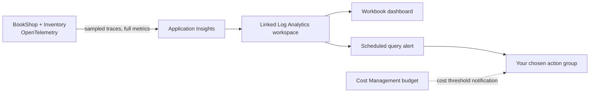

# Lab 9: Alerts, dashboards, sampling, cost, and cleanup

## Goal

Turn the deployed BookShop and Inventory telemetry into a small operational view: a workbook dashboard, one actionable alert, and a sampling experiment. Then review Azure Monitor costs and remove the temporary compute and alert resources.

### Current lab resources

- Resource group: `rg-observability-labs`
- App Service Plan: `asp-observability-bd` (Linux F1 Free)
- BookShop: `bookshop-bd.azurewebsites.net`
- Inventory: `inventory-bd.azurewebsites.net`
- Application Insights: `appi-bookshop-bd`

The two apps are deployed and running. Before continuing, run the health and order checks in [Lab 8](lab-8-app-service-deployment.md) from your own browser or PowerShell. The previous execution environment could not reach the public host through its proxy, so the end-to-end request and telemetry still need confirmation from your side.

## Architecture



## 1. Confirm telemetry is arriving

From the linked Log Analytics workspace, open **Logs** and run:

```kusto
AppRequests
| where TimeGenerated > ago(1h)
| where AppRoleName in ("bookshop-api", "inventory-api")
| project TimeGenerated, AppRoleName, Name, Success, ResultCode, OperationId
| order by TimeGenerated desc
```

If there are no rows, return to Lab 8 and verify both `/health` URLs and one successful `POST /orders`. Check that both App Service apps have `APPLICATIONINSIGHTS_CONNECTION_STRING`, and that their service names are `bookshop-api` and `inventory-api`. Wait a few minutes for ingestion before proceeding.

## 2. Build a Workbook dashboard

Workbooks are interactive dashboards that combine text, KQL, tables, and charts. They let us show a few investigation views together without creating a separate dashboard tile for every query. [Create or edit an Azure Workbook](https://learn.microsoft.com/en-us/azure/azure-monitor/visualize/workbooks-create-workbook)

1. Open `appi-bookshop-bd` in the Azure portal and select **Workbooks**.
2. Select **New** (or **New workbook**) and choose **Edit**.
3. Add a **Text** step titled `BookShop service health`; explain that `OperationId` ties the two services together.
4. Add a **Query** step using the linked Log Analytics workspace as the data source and **Logs** as the data type. Paste this query and choose a **Time chart** visualization:

```kusto
AppRequests
| where TimeGenerated {TimeRange}
| where AppRoleName in ("bookshop-api", "inventory-api")
| summarize
    Requests = sum(ItemCount),
    Failures = sumif(ItemCount, Success == false),
    P95DurationMs = percentile(DurationMs, 95)
    by bin(TimeGenerated, 5m), AppRoleName
| order by TimeGenerated asc
```

5. Add another **Query** step, set its visualization to **Grid**, and use this dependency view:

```kusto
AppDependencies
| where TimeGenerated {TimeRange}
| where AppRoleName == "bookshop-api"
| summarize
    Calls = sum(ItemCount),
    Failures = sumif(ItemCount, Success == false)
    by Name, Target
| order by Failures desc, Calls desc
```

6. Add a third **Query** step to compare stored request records with estimated represented volume:

```kusto
AppRequests
| where TimeGenerated {TimeRange}
| where AppRoleName in ("bookshop-api", "inventory-api")
| summarize StoredRows = count(), RepresentedItems = sum(ItemCount)
    by AppRoleName, Name
| order by RepresentedItems desc
```

7. Save as **`wb-observability-labs-bd`**, in `rg-observability-labs`, and choose an appropriate shared resource scope if the portal asks. Use the workbook time picker to switch between the last hour and last day.

The first chart shows request volume, failures, and latency by service; the second shows BookShop's outgoing calls; the last makes the effect of sampling visible when represented item counts differ from stored rows. Workbook table/column availability depends on the workspace schema; use the table schema if a column name differs.

## 3. Create and test one log alert

This lab uses a scheduled query alert because it can express a KQL condition. Alert rules can be billed; query evaluation frequency affects cost. This rule uses a five-minute frequency and no split-by dimensions to keep the example simple. Check the alert estimate/pricing shown in your subscription. [Azure Monitor alert types and costs](https://learn.microsoft.com/en-us/azure/azure-monitor/alerts/alerts-types) · [Create a log search alert](https://learn.microsoft.com/en-us/azure/azure-monitor/alerts/tutorial-log-alert)

1. In the linked Log Analytics workspace, select **Logs** and run:

```kusto
AppRequests
| where TimeGenerated > ago(5m)
| where AppRoleName == "bookshop-api"
| where Success == false
```

2. Select **New alert rule** from the Logs toolbar.
3. Keep the workspace as the scope. In **Condition**, use **Number of results** (table row count) and set the threshold to **Greater than 0**.
4. Set the evaluation frequency and lookback period to **5 minutes**. Use a 5-minute window for this learning alert. Avoid splitting by dimensions for this single-app exercise.
5. Set severity to **Sev 2 (Warning)**. Name it **`alert-bookshop-failures-bd`**.
6. On **Actions**, select an existing action group that you control, or create one with only your own email address. Creating an email action group sends a test/verification message; do not add other recipients without their permission.
7. Review the rule and its cost information, then create it.
8. Trigger the deterministic lab error by opening `https://bookshop-bd.azurewebsites.net/lab/failure`. It returns HTTP 500 and should produce a failed request. Wait for ingestion and the next alert evaluation; confirm the alert appears in **Monitor > Alerts** and, if configured, your action group notifies you.
9. After it fires, resolve/close the test alert. Keep the rule only while you are learning from it; remove it in the cleanup section.

This rule counts failed request records. Because traces can be sampled, a production alert should usually rely on an unsampled metric or another signal with known completeness. Azure Monitor metrics are not sampled by the trace sampler. High-frequency KQL alert evaluations are also more expensive than infrequent ones.

## 4. Experiment with trace sampling

The Azure Monitor .NET Distro uses a rate-limited sampler by default (currently up to about five traces per second). Sampling makes a decision for the trace, preserving related spans together. Metrics are not sampled, and logs associated with unsampled traces are normally dropped by default. [Azure Monitor .NET Distro configuration](https://learn.microsoft.com/en-us/dotnet/api/overview/azure/monitor.opentelemetry.aspnetcore-readme?view=azure-dotnet) · [Sampling configuration](https://learn.microsoft.com/en-us/azure/azure-monitor/app/opentelemetry-configuration)

For an observable experiment, temporarily set both apps' App Service environment settings in **Settings > Environment variables**:

| Setting | Value |
| --- | --- |
| `OTEL_TRACES_SAMPLER` | `microsoft.fixed_percentage` |
| `OTEL_TRACES_SAMPLER_ARG` | `0.5` |

Save the settings and let both apps restart. Using the same sampler settings on both services makes the example easy to reason about. `0.5` means roughly half the traces are retained; the exact count in a small sample is random. For a trace that is retained, expect the BookShop request, custom activity, HTTP dependency, and Inventory request to share one `OperationId`.

Generate a modest sample of requests from PowerShell:

```powershell
1..20 | ForEach-Object {
  try {
    Invoke-RestMethod -Method Post `
      -Uri "https://bookshop-bd.azurewebsites.net/orders" `
      -ContentType "application/json" `
      -Body '{"bookId":1,"quantity":1}' | Out-Null
  } catch {
    Write-Warning $_
  }
  Start-Sleep -Milliseconds 250
}
```

After ingestion, compare represented items (`ItemCount`) with stored trace rows:

```kusto
AppRequests
| where TimeGenerated > ago(1h)
| where AppRoleName in ("bookshop-api", "inventory-api")
| summarize StoredRows = count(), RepresentedItems = sum(ItemCount)
    by AppRoleName, Name
```

The retained sample will vary. Do not expect exactly 10 retained traces out of 20. Sampling reduces trace ingestion, but it also reduces the evidence available for queries and failure investigation. It doesn't reduce metrics.

When done, remove `OTEL_TRACES_SAMPLER` and `OTEL_TRACES_SAMPLER_ARG` from both apps' settings and save, returning to the Distro default. Keep the alert and dashboard queries in mind: sampled requests are not a reliable denominator for precise request counts or failure rates.

## 5. Review ingestion and cost controls

### Inspect the resource

1. Open `appi-bookshop-bd` > **Usage and estimated costs**. Check ingested volume, retention, daily cap, and the current price tier.
2. Open **Cost Management + Billing > Cost analysis** and select the `rg-observability-labs` scope. Review App Service (expected Free F1), Application Insights/Log Analytics, and alert-related meters separately. Cost data can arrive with a delay.
3. In the Log Analytics workspace, inspect billable ingestion by table:

```kusto
Usage
| where TimeGenerated > ago(7d)
| where IsBillable == true
| summarize IngestedGB = sum(Quantity) / 1000 by DataType
| order by IngestedGB desc
```

The `Usage` table is an operational estimate, not the invoice. The Cost Management view is authoritative for billed costs. Ingestion, retention, alerts, and notification features can have separate meters even when App Service compute is Free. [Azure Monitor cost and usage](https://learn.microsoft.com/en-us/azure/azure-monitor/usage-estimated-costs)

### Add a resource-group budget

In the Azure portal, open **Resource groups > `rg-observability-labs` > Budgets > Add**. Set a small monthly budget in the currency shown for your subscription, named **`budget-observability-labs-bd`**, and add email thresholds such as 50% and 80% for your own address. A budget is a notification threshold; it does not stop services or cap charges. Cost data and budget notifications can be delayed. [Create a Cost Management budget](https://learn.microsoft.com/en-us/azure/cost-management-billing/costs/tutorial-acm-create-budgets)

### Daily cap

The Application Insights daily cap is a last-resort stop on telemetry ingestion, not a substitute for cost review. If you choose to configure it, select a conservative limit based on the resource's current settings and understand that reaching it creates a telemetry gap until the cap resets. Don't lower it blindly during an investigation.

## 6. Clean up temporary lab resources

Remove the query alert first so it stops evaluating: open **Monitor > Alerts > Alert rules**, select `alert-bookshop-failures-bd`, then select **Delete**. Keep or delete the workbook according to whether you want to retain the learning artifact in Azure. Delete the two App Service apps and plan when finished:

```powershell
az webapp delete --resource-group rg-observability-labs --name bookshop-bd
az webapp delete --resource-group rg-observability-labs --name inventory-bd
az appservice plan delete --resource-group rg-observability-labs --name asp-observability-bd --yes
```

In **Cost Management + Billing > Budgets**, delete `budget-observability-labs-bd` if you no longer want its notifications. Confirm that both apps, the alert rule, and the plan are gone. F1 compute is free, but clean up unused resources anyway. Remove any temporary sampling settings before deleting or before you decide to keep the apps online.

Keep `appi-bookshop-bd`, its Log Analytics workspace, and your learning notes if you want to preserve the telemetry/query history. Deleting the Application Insights resource or the entire `rg-observability-labs` group also removes that monitoring history and other resources. Do that only after reviewing the resource list and deciding you no longer need them.

## What you learned

- Workbooks bring key service health queries into one interactive view.
- An alert is a query/threshold/evaluation/action pipeline, and its evaluation frequency can affect cost.
- Trace sampling keeps a statistical sample of complete traces; metrics remain unsampled.
- App Service's Free F1 compute tier does not make Application Insights ingestion, retention, or alert rules universally free.
- A budget warns about spending but does not enforce a spending cap.
- Cleanup must distinguish disposable app compute from monitoring resources and telemetry history you may still need.

## Git checkpoint

After you complete the workbook, test the alert, run the sampling query, review costs, and record which resources you retained or deleted, commit your private notes and this lab:

```powershell
git add docs/lab-9-alerting-dashboards-cost-cleanup.md docs/observability-learning-path.md
git commit -m "docs: add alerting and cleanup runbook"
git push
```

## Completion check

You can inspect the two service roles in a workbook, explain what the alert evaluates and when it fires, compare sampled rows with represented items, review Azure Monitor costs, and identify which resources are safe to delete while preserving the telemetry history you want.
