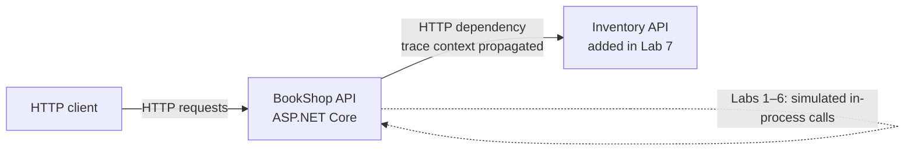
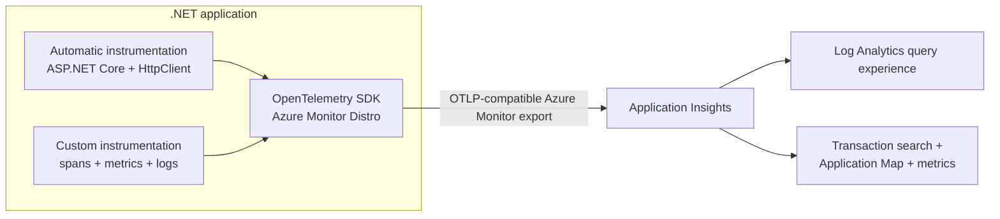
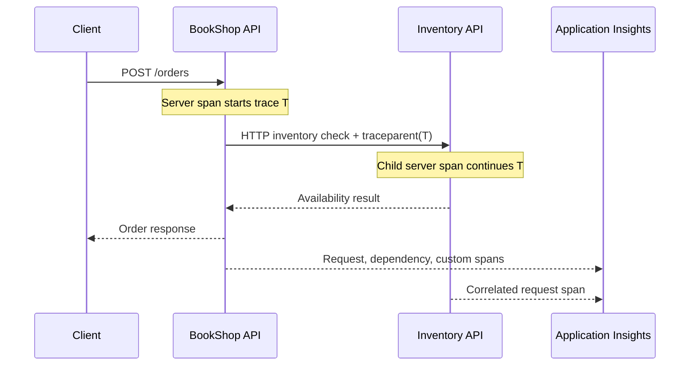

# Azure Observability with .NET and OpenTelemetry

## Learning context

This repository is a hands-on learning journal and lab workspace for understanding application observability with .NET, OpenTelemetry, and Azure Monitor. Each lab should leave behind a runnable change, notes explaining what was learned, and a Git commit that marks the checkpoint. Run Azure labs only in a dedicated resource group, and remove billable resources when a lab is complete.

### Outcomes

By the end of the path, you should be able to:

- Explain logs, metrics, and distributed traces, and how trace context connects work across service boundaries.
- Add automatic and custom OpenTelemetry instrumentation to an ASP.NET Core service.
- Send telemetry to Azure Monitor and inspect it in Application Insights and Log Analytics.
- Use queries, dashboards, alerts, and sampling to investigate behavior and control telemetry volume.
- Deploy the same app to Azure and reason about configuration, identity, cost, and operational tradeoffs.

## Proposed teaching application: BookShop

Build one deliberately small ASP.NET Core minimal API for a fictional bookstore. It has an in-memory catalog and order flow, so the first labs need no database or paid dependencies.

Initial endpoints:

- `GET /health` — simple health response.
- `GET /books` and `GET /books/{id}` — catalog reads.
- `POST /orders` — validates a request, simulates inventory lookup and payment authorization, and returns an order ID.
- `GET /orders/{id}` — retrieve an in-memory order.
- `GET /lab/failure` — deterministic failure for learning error telemetry; do not expose this pattern in a real public service.
- `GET /lab/slow` — controlled delay for latency demonstrations.

The simulated downstream calls will first be in-process delays, then move to a second small ASP.NET Core service (`Inventory.Api`) so we can observe propagation of W3C trace context across HTTP. Avoid adding a real payment integration, database, or queue until the signals and query skills are established.

### Application shape as the labs progress



## Approach

1. Start with an uninstrumented app and a Git checkpoint. Establish what the application does before looking at telemetry.
2. Add OpenTelemetry concepts and automatic ASP.NET Core / `HttpClient` instrumentation; inspect local console or OTLP output.
3. Add custom spans, attributes, events, metrics, and structured logs. Learn cardinality and sensitive-data pitfalls as part of each change.
4. Create Azure Monitor resources and connect the app using the Azure Monitor OpenTelemetry Distro for ASP.NET Core. Keep connection strings in local environment configuration, never in Git.
5. Query requests, dependencies, exceptions, traces, and custom metrics in Application Insights / Log Analytics. Practice a few investigations from symptom to cause.
6. Add a second service and follow a distributed trace end to end.
7. Deploy to Azure App Service (simple managed hosting), configure telemetry safely, and repeat the investigations against a deployed instance.
8. Add an alert and a basic dashboard/workbook; examine sampling, retention, ingestion cost, and cleanup.

The Azure Monitor Distro is the initial Azure path because Microsoft documents it as the recommended one-package onboarding option for ASP.NET Core; it sends OpenTelemetry data to Application Insights. We will first learn the OpenTelemetry signals and instrumentation model so the Azure-specific exporter does not obscure the concepts. [Microsoft .NET example](https://learn.microsoft.com/en-us/dotnet/core/diagnostics/observability-applicationinsights) · [Azure Monitor Distro reference](https://learn.microsoft.com/en-us/dotnet/api/overview/azure/monitor.opentelemetry.aspnetcore-readme?view=azure-dotnet)

### Telemetry path

The app creates telemetry through automatic and custom instrumentation. OpenTelemetry batches and exports it; Application Insights stores and presents the signals, while Log Analytics provides the query experience used in the investigation lab.



### Trace correlation across services

Each inbound request begins or continues a trace. Outgoing HTTP instrumentation injects the W3C trace context into the request to Inventory, allowing both services' spans to appear in one end-to-end trace when exported to the same Application Insights resource.



## Lab sequence

| Lab | Topic | Azure resources | Git checkpoint |
| --- | --- | --- | --- |
| 0 | Prerequisites, repo conventions, cost boundary | None | `docs: add observability learning context` |
| 1 | Create and explore the BookShop API | None | `feat: add baseline bookshop api` |
| 2 | OpenTelemetry mental model and local automatic instrumentation | Local only | `feat: add local otel instrumentation` |
| 3 | Custom spans, attributes, events, and error/latency experiments | Local only | `feat: add bookshop custom telemetry` |
| 4 | Metrics and structured logs | Local only | `feat: add business metrics and structured logs` |
| 5 | Azure Monitor / Application Insights ingestion | App Insights + Log Analytics | `feat: export telemetry to azure monitor` |
| 6 | KQL investigations and trace correlation | Existing lab workspace | `docs: add azure monitor investigation queries` |
| 7 | [Inventory service and distributed tracing](lab-7-distributed-tracing.md) | Local only | `feat: trace bookshop across services` |
| 8 | [Deploy both APIs to Azure App Service](lab-8-app-service-deployment.md) and configure telemetry | App Service + existing monitoring resources | `docs: add app service deployment lab` |
| 9 | [Alerting, dashboard, sampling, cost, and cleanup](lab-9-alerting-dashboards-cost-cleanup.md) | Existing lab resources | `docs: add alerting and cleanup runbook` |

## Repository conventions

- One commit per completed lab, with the topic-specific message shown above or a close equivalent.
- Keep secrets, connection strings, subscription identifiers, and personal telemetry out of Git. Commit only a redacted `.env.example` if needed; ignore actual local settings.
- Record commands, expected observations, actual observations, and questions in each lab's notes.
- Prefer one Azure resource group with a clearly recognizable lab name and a single region. Record the chosen region and resource names in a local note that is ignored by Git.
- Use Azure CLI interactively and confirm the active subscription before creating resources. Delete the lab resource group at the end unless you deliberately choose to keep it and understand ongoing charges.

## Lab 0 — Set up the learning workspace

### Goal

Prepare a safe, repeatable workspace and identify which commands are available before creating Azure resources.

### Prerequisites to check

In PowerShell, run:

```powershell
dotnet --info
git --version
az version
az account show --output table
```

You need a supported .NET SDK, Git, Azure CLI, and an Azure subscription you are allowed to use. If `az account show` says you are not logged in, run `az login`, then run `az account show --output table` again. If you have multiple subscriptions, list them with `az account list --output table` and select the intended one with `az account set --subscription "<subscription-id-or-name>"`.

### Understand the safety boundary

No Azure resources are needed for Labs 0–4 and 7. Later labs create billable Azure resources. Before those labs, we will choose a resource group and region, inspect the active subscription, and use the smallest suitable hosting option. Do not paste credentials, connection strings, or unredacted telemetry into commits.

### Git checkpoint

Review the document and your repo status:

```powershell
git status --short
git add docs/observability-learning-path.md
git commit -m "docs: add observability learning context"
```

If the repository has a different documentation convention, keep this content but move it into the established location before committing. Do not include unrelated changes in this commit.

### Completion check

You have confirmed the tools and subscription, understand that local labs do not create Azure charges, and committed the learning context. Next, we will create the baseline API without telemetry, run it, and learn its behavior before instrumenting it.
